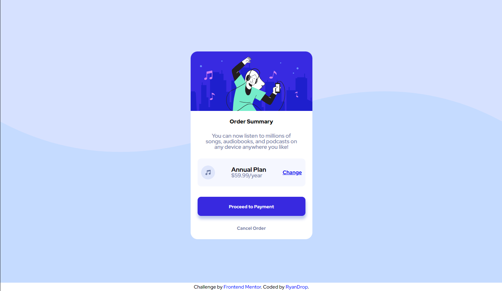
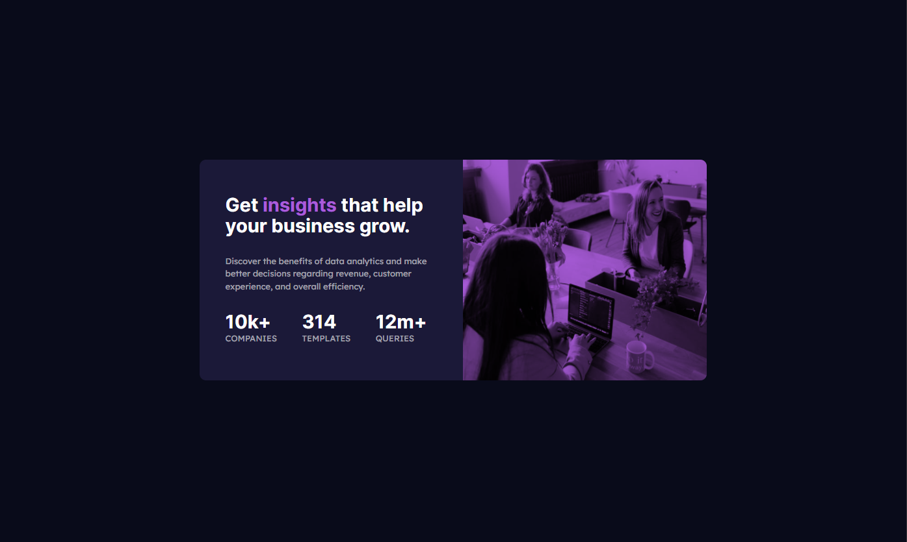

# FrontendMentorNewbie
Desafios para iniciantes em Frontend no FrontendMentor, realizados por mim para treinar meus conhecimentos.

|                            Order-Summary                            |                             Stats-Preview                          |
| :----------------------------------------------------------------------: | :---------------------------------------------------------------------: |
| <kbd></kbd> | <kbd></kbd> |

| :globe_with_meridians: FrontEnd |
| :-----------------------------: |

| [HTML 5](https://www.w3schools.com/html/) |
| [CSS3](https://www.w3schools.com/css/) |

## :boy: _Autor_

<a href="https://github.com/RyanDrop">
 
  
 <b>RyanDrop</b>
</a>

Desenvolvido com ❤️ por RyanDrop👋🏽 Meus Contatos!

